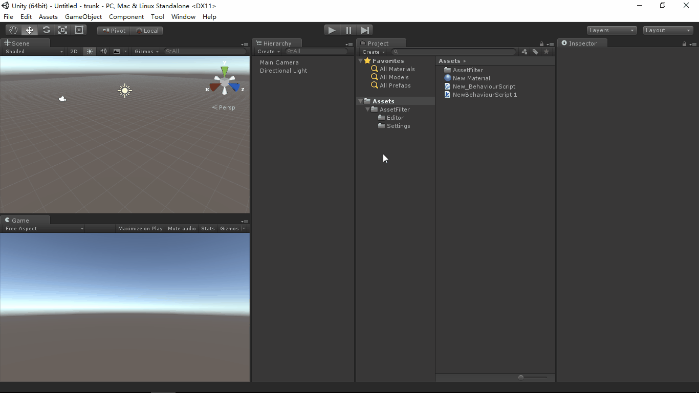

# AssetFilter
- [中文手册](./README_ZH.md)

## Summary
Unity plugin for asset name specification filter.

## Demand
- Define the specification of asset name.
- Check the name of assets under the target directory, filter and
  display the assets those name is mismatch the define specification.

## Environment
- Unity 5.0 or above.
- .Net Framework 3.0 or above.

## Achieve
- AssetPatternSettings : Config the asset name specification.
- AssetFilterEditor : Draw the extend editor window and select the
  target directory and specification config, Filter/Browse/Focus the
  assets those name is mismatch the define specification.

## Preview
- Asset Filter Editor

## Contact
- If you have any questions, feel free to contact me at mogoson@qq.com.