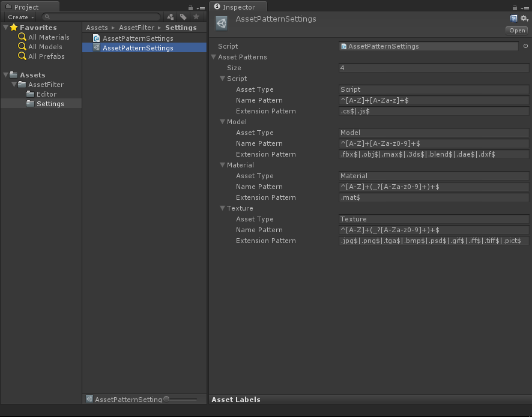
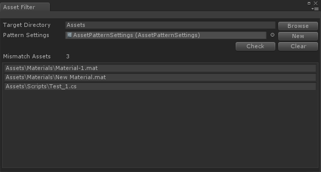

# AssetFilter
- [English Manual](./README.md)

## 概述
Unity3D 资源文件命名规范过滤器。

## 需求
- 自定义各种类型资源文件的命名规范。
- 检查指定资源目录下所有资源文件的命名，依据命名规范过滤出不遵循规范的文件。

## 环境
- Unity 5.0 或更高版本。
- .Net Framework 3.0 或更高版本。

## 实现
- AssetPatternSettings：资源文件命名规范模板配置；
- AssetFilterEditor：绘制扩展编辑器窗口，选择目标资源文件夹，命名规范配置文件；过滤，浏览，定位不遵循规范的资源文件。

## 图示
- Asset Pattern Settings

- Asset Filter Editor

## 联系
- 如果你有任何问题或者建议，欢迎通过mogoson@qq.com联系我。